..
   SNES2C64 documentation master file, created by
   sphinx-quickstart on Thu Jan 19 12:17:03 2023.
   You can adapt this file completely to your liking, but it should at least
   contain the root `toctree` directive.

.. include :: ./_static/buttons.rst
.. include :: ./_static/links.rst
.. include :: ./_static/images.rst

##########
English
##########

All about this project is found in this github organization `github/snes2c64`_.

*********************
Assembly from the Kit
*********************

After Unpacking your Kit you should have something like this:

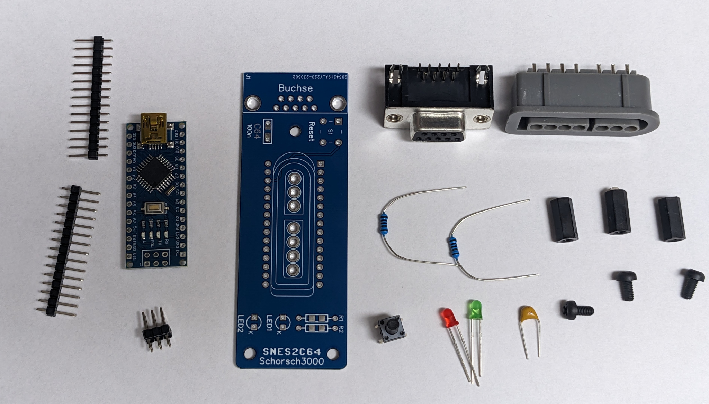

get Your soldiering iron ready and follow this step by step guide:

At first Position all the Small parts, the shorter leg of the LED's needs top be in the HOle labeled K:

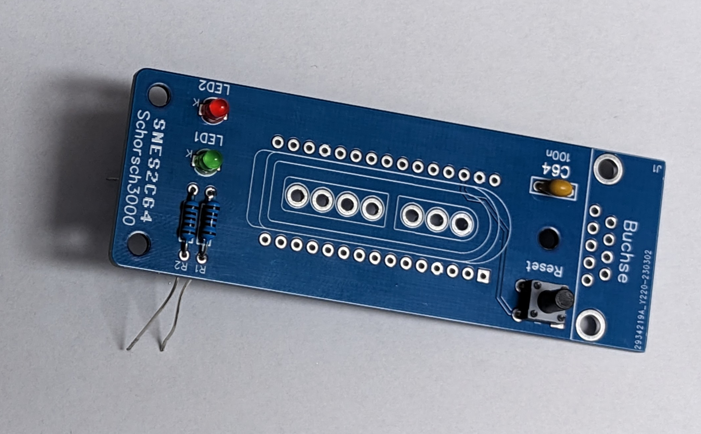

Now Solder all the Pads, Make sure everything sits tight against the PCB so it doesn't look all wonky.

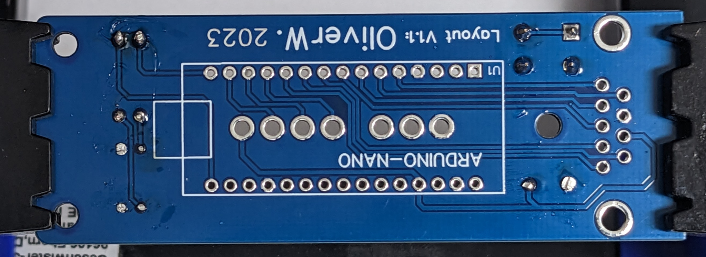

Now Drop in the SNES-Connector. It's important that this is done before the Arduino is placed!

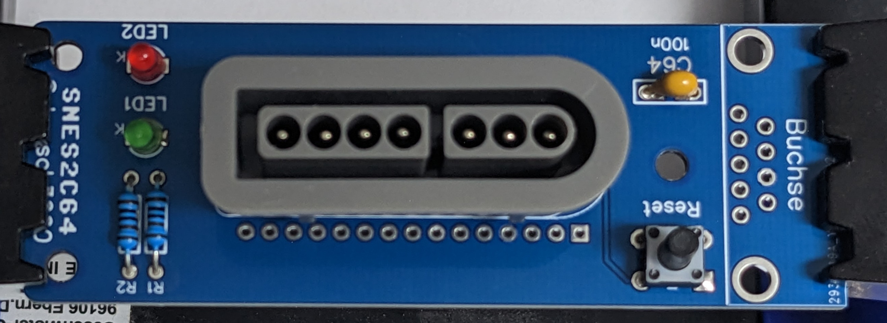

Tape or hold in place and solder.

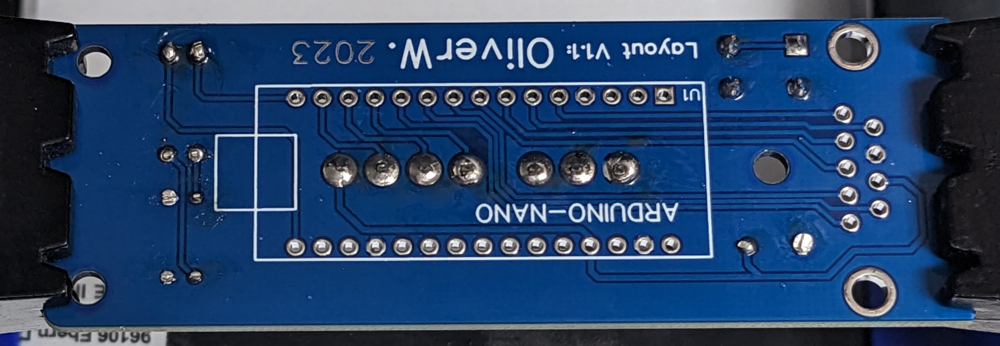

Now drop in the pin headers for the Arduino. Have the Adapters PCB upside down (Text: ARDUINO-NANO visible) and drop them with the long side down.
Do not solder them yet!

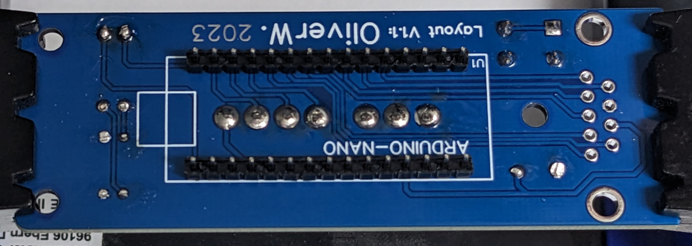

Next Place the Nano on top of that upside up, meaning the bottom side of the nano faces the bottom side of the PCB.

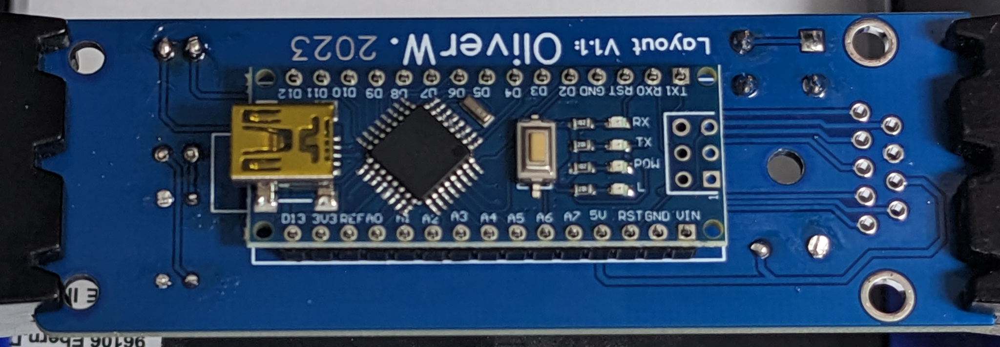

Solder the pin headers to the Arduino

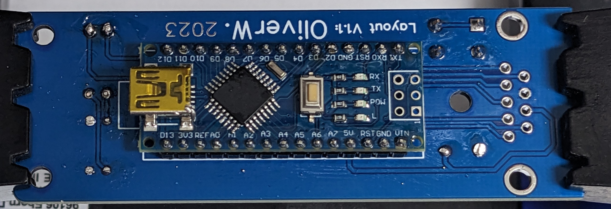

Make sure the bottom of the Nano doesnt touch the SNES connectors solder joints.
I used matches with removed heads as spacers to ensure good alignment on both sides between the adapters PCB and the plasticpart of the pin headers.

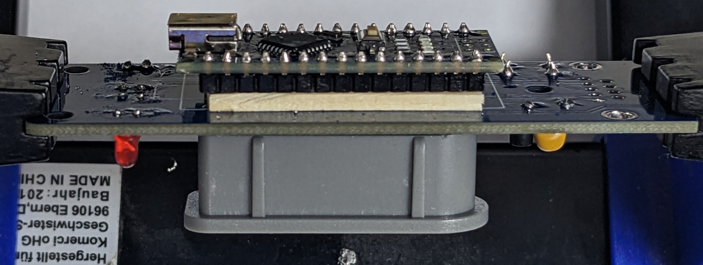

Solder The pin headers from the topside.

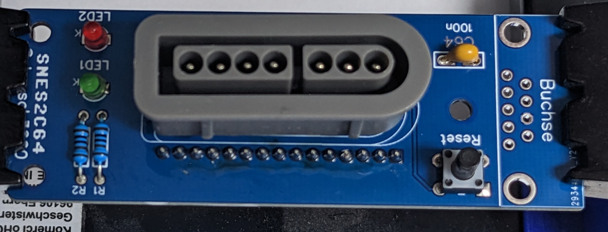

Drop in the 9 pin D-Sub connector, make sure it sits tight.

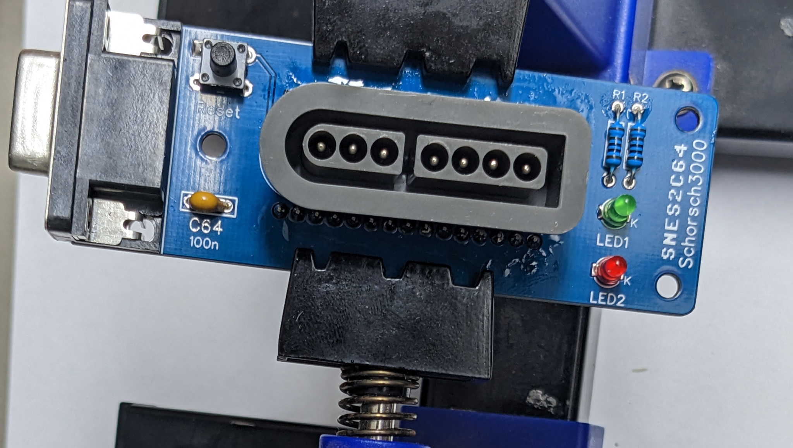

Solder, start with the clamps and finish with the pins.

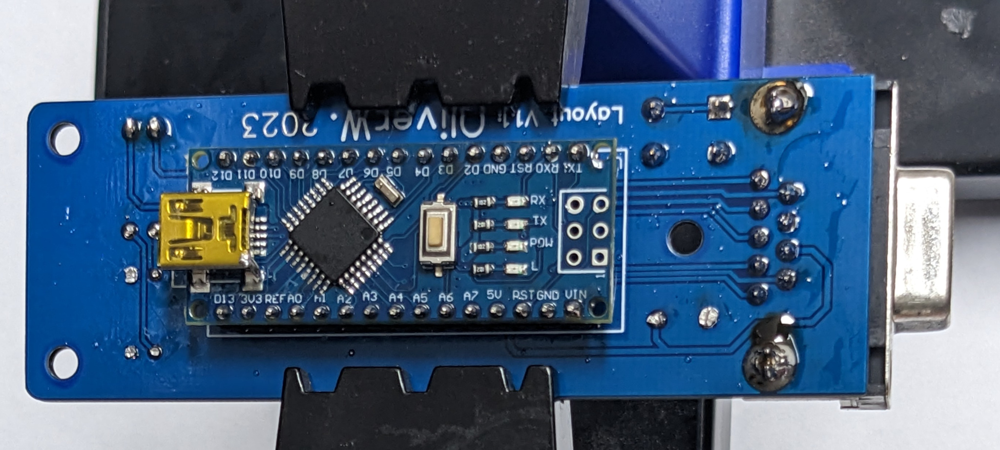

Now it's time to clean up.

When finished, screw the 3 screws with the matching spacers and you are done.
Things should look like this now:

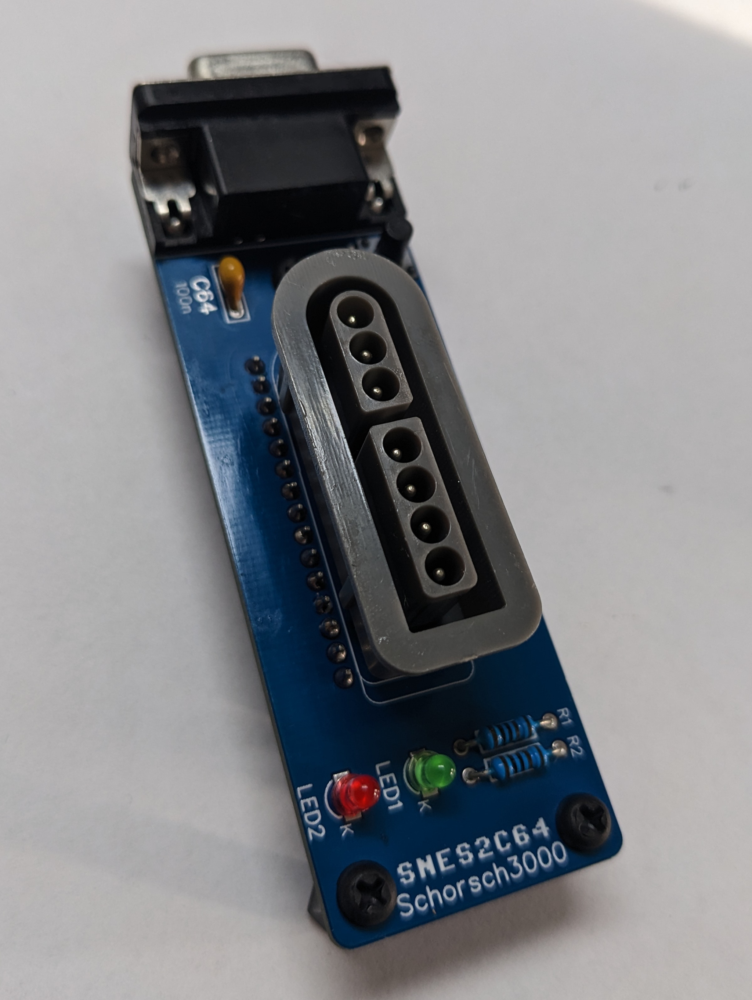

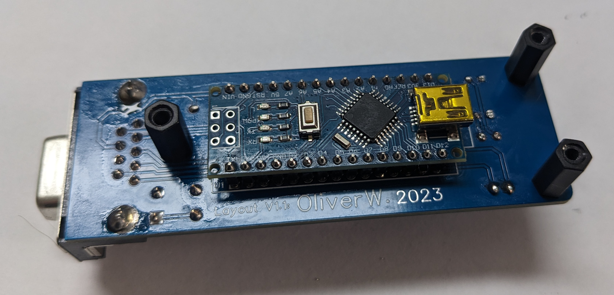

**************************
Icon used in this Document
**************************

.. list-table:: Icon Description
    :widths: 50 50
    :header-rows: 1

    * - Icon
      - Description
    * - |F1|
      - Fire (1) on C64 pressed
    * - |F2|
      - Fire (2) on C64 pressed
    * - |F3|
      - Fire (3) on C64 pressed
    * - |AF|
      - Any action in combination with with this is not pressed constantly but in a repeating manner
    * - |SU|
      - Up on Gamepad pressed
    * - |SD|  
      - Down on Gamepad pressed
    * - |SL|
      - Left on Gamepad pressed
    * - |SR|
      - Right on Gamepad pressed
    * - |CU|  
      - Up on C64 Joystick pressed
    * - |CD|  
      - Down on C64 Joystick pressed
    * - |CL|
      - Left on C64 Joystick pressed
    * - |CR|  
      - Right on C64 Joystick pressed
    * - |A| 
      - Button A on Gamepad pressed
    * - |B| 
      - Button B on Gamepad pressed  
    * - |X|
      - Button X on Gamepad pressed
    * - |Y|
      - Button Y on Gamepad pressed
    * - |L|
      - Shoulder L on Gamepad pressed
    * - |R|
      - Shoulder R on Gamepad pressed
    * - |ST|
      - Start on Gamepad pressed
    * - |SE|
      - Select on Gamepad pressed
    

This Project is an highly configurable adapter to use a SNES controller
as a Commodore 64 Joystick.

It supports up to 3 fire buttons per Joystick using POTX and POTY as
utilized in games like `MW_ULTRA`_ or anything on the `multi_button_game_list`_ and can
be tested with `Anykey`_ or `Joyride`_.

It contains of multiple Parts:

   -  The Hardware, which is basically

      -  a Arduino Nano
      -  2 LED's with resistors
      -  a 9 pin D-Sub connector to connect to the C64
      -  a SNES connector
      -  and last but not least a PCB kindly layouted by `OliverW.`_

   -  Firmware for the Arduino Nano
   -  a cli and gui application to configure the adapter kindly provided by `Tim`_

**************
 Build you Own
**************

You have a few Options here:
   -  you can order you PCB's with the Gerber's released after the initial order is finished
      release
   -  design your own PCB
   -  Just do it using flying wires

=================
 schematics / diy
=================

Schematics are super simple, the designed board uses these over here
`Schematics`_ but most of it is flexible. Surely GND from the SNES Connector,
the C64 Connector and the Arduino should be connected, same goes for the
+5V.

All other Pins from the C64 connector and the used Pins from the
SNES-Connector needs to be connected anywhere from D2-D13 on the
Arduino. 2 LED's should be connected to the Arduino as well, one to 2
Pins that are not used up. Preferably one LED should be connected to
PIN13 since it is the one that is used for the LED_BUILTIN. All Pins can
be assigned in the firmware to match up to your wiring.

LED's are optional but are nice to get feedback from the adapter.

===================
 bill of materials
===================

Sized are only critical if you use OliverW.'s Gerbers, otherwise you can use whatever you want.
   -  Arduino Nano

   -  2 LED's either 3mm or SMD, 2 different colors

   -  2 resistors matching your LED's either 1/4W TH or SMD

   -  9 pin D-Sub connector like `W+P 107-09-2-1-0`_ from Reichelt.de

   -  SNES connector standing. Easily found on aliexpress or Ebay with search term `SNES controller connector`.
      Usually there a 2 different types, standing and angled. While Both
      fit if you use just one Adapter, you can't connect anything in
      Port1 if you use an angled Connector in Port2.

   -  optional: a tactile switch to reset the Arduino.

   -  optional but recommended: 3 M3 Screws 5 to 10mm long and 3 M3
      standoffs 5 to 10mm long so that the adapters Connector sits at
      the same height then the C64's, alternatively a 3d Printed Case //TODO

   -  For sure you'll need a SNES controller, the Cheap ones from aliexpress for about 10 bucks are fine.

=======================
 flashing the firmware
=======================

The firmware is found in this Repository: `github/snes2c64/firmware`_.

You either could open the firmware.ino in the Arduino IDE and flash it
from there or use the hex file from the releases and flash that in a way
convenient for you. Make sure you have at least set the pins correct if
you don't use the default wiring.

Things you might want to change in Firmware either way:

.. code::

   // START OF CONFIGURATION
   #define MAPCOUNT 8                     // Number of Maps, might be 1-8,
   // clang-format off
   const byte defaultMaps[10*MAPCOUNT] = {             // Configuration of you Default maps,
                       /* B     */ FN_FIRE,
                       /* Y     */ FN_FIRE | FN_AUTO_FIRE,

                       /* ️️UP    */ FN_UP,
                       /* DOWN  */ FN_DOWN,
                       /* LEFT  */ FN_LEFT,
                       /* RIGHT */ FN_RIGHT,
                       /* A     */ FN_FIRE2,
                       /* X     */ FN_FIRE2 | FN_AUTO_FIRE,
                       /* L     */ FN_FIRE3 | FN_AUTO_FIRE,
                       /* R     */ FN_FIRE3,

                       /* B     */ FN_FIRE,
                       /* Y     */ FN_UP,
                       /* ️️UP    */ FN_UP,
                       /* DOWN  */ FN_DOWN,
                       /* LEFT  */ FN_LEFT,
                       /* RIGHT */ FN_RIGHT,
                       /* A     */ FN_FIRE | FN_AUTO_FIRE,
                       /* X     */ FN_FIRE2,
                       /* L     */ FN_FIRE3,
                       /* R     */ FN_FIRE3,
                       };
   // clang-format on

   // configuration of assigned pins
   #define PIN_LED2 13 // pins for both led'S
   #define PIN_LED1 12
   #define PIN_CLOCK 11 // pins for the SNES connector's clock pin
   #define PIN_LATCH 10 // pins for the SNES connector's latch pin
   #define PIN_DATA 9   // pins for the SNES connector's data pin

   #define PIN_UP 8     // pins for the C64 connector's up pin
   #define PIN_DOWN 6   // pins for the C64 connector's down pin
   #define PIN_LEFT 5   // pins for the C64 connector's left pin
   #define PIN_RIGHT 2  // pins for the C64 connector's right pin
   #define PIN_FIRE 7   // pins for the C64 connector's fire pin
   #define PIN_FIRE2 4  // pins for the C64 connector's fire2 (POTX) pin
   #define PIN_FIRE3 3  // pins for the C64 connector's fire3 (POTY) pin

                                    // you are able to adjust autofire speed from the Controller.
   #define MIN_AUTO_FIRE_DELAY 2    // This is the minimum delay between autofire events in cylcles (HZ) lower than 1 makes no sense on a technical level
   #define MAX_AUTO_FIRE_DELAY 64   // This is the maximum delay between autofire events in cylcles (HZ) set it to whatever you want,
                                    // but setting it to high will most likely render autofire useless.
                                    // setting it to 64 with 100HZ will result in 1.64s between autofire events, thats 1.6s on followed by 1.6s off
   #define AUTO_FIRE_DELAY_START 4  // This is the autofire value thats set on startup and reset.

   #define HZ 100  // Frequency the SNES controller is polled and Data is written to the C64
                   // this might work with ridiculously fast values,
                   // but there is no need to go higher then 2 times your screen rate.

   #define EEPROM_OFFSET 0 // Configuration is stored in EEPROM at this offset and is 1+10*MAPCOUNT bytes long
                           // Sometimes bytes in EEPROm are broken so you might want to shift the offset if you got a bad Nano

*******
 Usage
*******

In Normal Mode the D-Pad and the Buttons A B X Y L and R are used for
game play and can be configured freely. you are able to configure up to
8 different button layouts called maps, by hardcoding them into the
firmware before flashing, or by changing them with the configuration
tool afterwards.

Any of these Buttons can be mapt to one, multiple or none of the
following functions:

-  Joystick Up
-  Joystick Down
-  Joystick Left
-  Joystick Right
-  Joystick Fire1
-  Joystick Fire2
-  Joystick Fire3
-  Auto Fire

Yes, that means you can map UP and DOWN to the L Button if you really
need to. A note about Auto fire: Auto fire is not "press the fire button
repeadly" it is "press all configured other buttons repeadly". Meaning:

-  setting the X button just to autofire will do nothing.
-  setting the X button to autofire and Fire1 will result in autofire
   for fire1
-  setting the X button to autofire and UP will result in autofire for
   UP
-  setting the X button to autofire and UP and Fire1 will result in
   autofire for UP and Fire1

In the default configuration there are 2 maps configured:

.. list-table:: Map1 (Default, works fine for most Games)
    :widths: 10 20
    :header-rows: 1

    * - PAD-Button
      - C64 Action
    * - |B|
      - |F1|
    * - |Y|
      - |F1| + |AF|
    * - |A|
      - |F3|
    * - |X|
      - |F3| + |AF|
    * - |L|
      - |F2| + |AF|
    * - |R|
      - |F2|
    * - |SU|
      - |CU|
    * - |SD|
      - |CD|
    * - |SL|
      - |CL|
    * - |SR|
      - |CR|

.. list-table:: Map2
    :widths: 10 20
    :header-rows: 1

    * - PAD-Button
      - C64 Action
    * - |B|
      - |F1|
    * - |Y|
      - |CU|
    * - |A|
      - |F1| + |AF|
    * - |X|
      - |F3|
    * - |L|
      - |F2|
    * - |R|
      - |F2|
    * - |SU|
      - |CU|
    * - |SD|
      - |CD|
    * - |SL|
      - |CL|
    * - |SR|
      - |CR|

This is useful for platformers and anything that uses UP as Jump, since you can jump using Y and still use the D-Pad for movement.

===============
Setting up maps
===============

You can setup up to 8 maps, they are used to map the SNES gamepad buttons to action triggered un the C64.
You can setup your default maps in sourcecode before uploading the firmware and you are able to manipulate the maps without flashing firmware with the `github/snes2c64/gui`_.

On a logic Level both are essential the same, but the GUI is much more user friendly.

Maps work like this:
Every map is a list of 10 bytes, each byte represents one of the 10 buttons on the SNES gamepad.
Each byte represents actions that are triggered when the button is pressed.
Possible Actions are:

.. list-table:: Actions
    :widths: 33 33 33
    :header-rows: 1

    * - Icon
      - Description
      - Name in Sorce Code
    * - |F1|
      - Fire (1) on C64 pressed
      - `FN_FIRE`
    * - |F2|
      - Fire (2) on C64 pressed
      - `FN_FIRE2`
    * - |F3|
      - Fire (3) on C64 pressed
      - `FN_FIRE3`
    * - |AF|
      - Autofire
      - `FN_AUTO_FIRE`
    * - |CU|
      - Up on C64 Joystick pressed
      - `FN_UP`
    * - |CD|
      - Down on C64 Joystick pressed
      - `FN_DOWN`
    * - |CL|
      - Left on C64 Joystick pressed
      - `FN_LEFT`
    * - |CR|
      - Right on C64 Joystick pressed
      - `FN_RIGHT`

Any Button can be assigned none, one or many of these actions.
Be aware that |AF| is not an action on its own, it is a modifier for other actions on the same button.
|AF| ist not "press the fire button repeadly" it is "press all configured other buttons repeadly".
It could be "pressign |CD| repeatetly" or "pressing |F1| and |CU| repeadly" when paired with |F1| or |CU|.

You can have multiple actions on one button, eg. you can bind |F1| and |CU| to the same button,
you could even bind |CU| and |CD| to eg. the |L| button, if you really want to.

============================
Button Mapping in sourcecode
============================

at the top of the firmware.ino file find `const byte defaultMaps`...
This is where you can set your default maps.
It's just a comma separated list actions.
Every 10 actions are one map.
The corresponding buttons for each map are in the order:
|B|, |Y|, |SU|, |SD|, |SL|, |SR| , |A|, |X|, |L|, |R|

So the first 10 elements are for the first map (|B|), elements 11-20 are for the second map (|Y|) and so on.

If you need to have no action on a button, just put `FN_NONE` there.
To have multiple actions on one button, just "add them up" using `|` as in  `FN_FIRE | FN_AUTO_FIRE`.

===========================
Button mapping with the gui
============================

To use the gui you need to have the `github/snes2c64/gui`_ downloaded to your computer.
First you need to connect the adapter to your computer.
Then you need click connect and choose the right serial.
Then you can choose a map.
You should see something like this:

|SC_GUI_MAP1_EDIT|

You are now viewing / editing Map1 (|B|), see the lower left corner.
Every column represents one button on the SNES gamepad which is indicated by the icon in the first row.
All other icons in a column represent actions that are mapped to that button.
The grayish ones are deactivated, the white ones are active, click to toggle.
Ones you are finished click "Upload" to Upload this map to the adapter.
To Edit another map click the button in the lower left corner, the Map chooser you have already seen wil pop up again.

============================
Disabling Buttons
============================

To Prevent accidental jumps you can Disable any Button on the fly.
Just Press SELECT followed my the Button you want to disable.
it is now Disabled, you can reverse is the same way.
Use This for UP with map2 for example in Giana Sisters to have better Jump Control.

============================
Choosing a Map
============================
To choose a Map just press START and the Button of the Map you want to.
Possible Buttons are A, B, X, Y, L, R, UP, DOWN, LEFT, RIGHT.

============================
Setting Autofire Speed
============================

You can set the Autofire Speed by Pressing and HOLDING START and pressing L or R for faster or slower.

============================
Resetting the Adapter
============================
If you cet stuck somehow by choosing a wrong map and / or disabling buttons (START and SELECT can't be disabled) you can reset the adapter bei either
- unplugging it
- pressing START and SELECT together
- pressing the reset button

********************
Reading LED Feedback
********************

============================
Starting Up
============================

After Starting up in a fast pace LED1 turns on Followed by LED2 and both turning off in the same sequence.
Your Adapter is ready to use now.

============================
Normal Use
============================

In normal mode LED1 is on if any of the gameplay buttons (A B X Y L R or DPAD) is pressed.
LED2 is on if any action for the C64 is on.

This means, using the default map1:
- while holding down the B Button LED1 is on and LED2 is on.
- while holding down the Y Button LED1 is on and LED2 is flashes since it's autofireing Fire1.
- while holding down the Y and B Buttons LED1 and LED2 are on since there is always at least one actiopn for the C64 triggerd.
- with a disabled Y Button while Y is pressed LED 1 is on and LED2 is off.

============================
Choosing a Map
============================
When choosing a map by Pressing START, LED1 starts flashing for 2 seconds and turns of after.
While LED2 is flashing you can choose a map by pressing the Button of the map you want to choose.
Map to Button Mapping is as follows:

.. list-table:: Map to Button
    :widths: 10 20
    :header-rows: 1

    * - 1
      - |B|
    * - 2
      - |Y|
    * - 3
      - |SU|
    * - 4
      - |SD|
    * - 5
      - |SL|
    * - 6
      - |SR|
    * - 7
      - |A|
    * - 8
      - |X|

When a map is chosen, LED1 stays on while LED2 blinks the number of the map you chose.
then Both LEDs turn off, the map is active and normal mode is active again.

When a Map is chosen that is empty (no buttons mapped or only mapped to autofire without an actual action),
the Firmware refuses to activate that map. It show that by rapidly flashing LED1 and LED2 for 2 seconds in a alternating pattern.
Afterwards it show the previous map as if you chose that map.
eg:
assuming default configuration (map 1 and 2 are set, map 3 is empty), you are on map 2 and choosing map 3:
LED1 and LED2 start flashing in an alternating pattern, followed by LED1 turning on and LED2 blinking 2 times.

If START is pressed accidentally and you don't want to wait 2 seconds you can stop choosing with SELECT.

============================
Button disable toggling
============================

When disabling or enabling again a Button, LED2 starts flashing for 2 seconds and turns of after.
While LED1 is flashing you can choose a button to disable by pressing the Button you want to disable.

When a button is pressed LED2 stays on for about 2 seconds.
In that 2 Seconds LED1 displays the new status of that button.
ON for enabled and OFF for disabled.

If SELECT is pressed accidentally and you don't want to wait 2 seconds you can stop choosing with START.

============================
Setting Autofire Speed
============================

You can set the autofire speed by pressing and holding START and pressing L or R.
Both LEDs start flashing with the Autofire speed.
You can release START now.
You can now change the speed by pressing L or R, either single stepping or just holding one of them down.
AutofireSettingMode stops when neither L or R is pressed for 3 seconds or you press start again.

============================
Resetting the Adapter
============================

You can reset the adapter basically in 2 Ways:
- unplugging it or using the Reset on the Arduino
- pressing START and SELECT together

When resetting with a power cycle or the actual reset the adapter will behave as described in "Starting Up".

When resetting with START and SELECT LEDS 1 and 2 will flash in an alternate pattern for about 1 second and then turn off.
The firmware is not actually now but brought back to the state it was in when the adapter was started.

If using the SOFT-reset via START and SELECT will result in a different behavior then a HARD-reset via the reset button you probably have found a bug, please report it.

*****
Resetting the EEPROM
*****

In case you want to reset the EEPROM to the default configuration within the firmware code you can do so by holding B A X Y and R while starting the adapter.
Both LED's will light up and stay until you release the buttons.
Now the Adapter waits for your confirmation to reset the EEPROM.
You can do that by pressing START SELECT L and R.
Once that's done the Adapter will reset the EEPROM and restart.

##########
Deutsch
##########

Alle Informationen zu dem Projekt finden sich unter `github/snes2c64`_.

*************************************
Bausatz Schritt für Schritt Anleitung
*************************************

Der Inhalt deines Bausatzes sollte Etrwa so aussehen:

Schnapp dir dein Lötkolben und folge dieser Anleitung:

Zuerst sind die ganzen Kleinteile dran. Die LED's kommen mit dem Langen bein in das mit K beschriftete Loch.

Verlöte alles, pass dabei auf das alles spack an der Platine sitzt damit es hinterher nicht windschief aussieht.

Setze nun die SNES-Buchse ein. Es ist wichtig das sie vor dem Arduino verlötet wird.

Klebe sie fest oder Halte sie mit der Hand gerade und Verlöte sie.

Setze jetzt die Pfostenleiste ein, Die Platine muss mit der Beschriftung ARDUINO-NANO nach oben liegen, die Lage seite der Pinne muss durchgesteckt werden.
Löte die Leiste noch nicht ein!

setze jetzt den Nano auf die Pfostenleiste. Die Unterseite des Arduinos zeigt dabei zur Unterseite der Adapterplatine.

Verlöte jetzt den Arduino an die Leiste.

Stelle sicher das die Unterseite des Arduinos nicht die Lötstellen der SNES-Buchse berührt. das geht wunderbar z.B. mit Streichhölzern zwischen der Platine und den Plastikteil der Leiste.

Löte jetzt die Leiste auf der Oberseite an.

Setze die Sub-D Buchse ein so das sie flach auf der Platine aufliegt.

Verlöte die Buchse, am besten beginnst du mit den Klammern.

Jetzt noch schnell reinigen, dann die Bolten verschrauben und fertig.

Idealer weise sieht's nun etwa so aus:

*************************
Icons und deren Bedeutung
*************************

.. list-table:: Icon Beschreibung
    :widths: 50 50
    :header-rows: 1

    * - Icon
      - Bedeutung
    * - |F1|
      - Feuer (1) am C64 gedrückt
    * - |F2|
      - Feuer (2) am C64 gedrückt
    * - |F3|
      - Feuer (3) am C64 gedrückt
    * - |AF|
      - Autofire, gild für jede combination mit dieser Aktion
    * - |SU|
      - Steuerkreuz am Gamepad nach oben gedrückt
    * - |SD|
      - Steuerkreuz am Gamepad nach unten gedrückt
    * - |SL|
      - Steuerkreuz am Gamepad nach links gedrückt
    * - |SR|
      - Steuerkreuz am Gamepad nach rechts gedrückt
    * - |CU|
      - C64 Joystick nach oben gedrückt
    * - |CD|
      - C64 Joystick nach unten gedrückt
    * - |CL|
      - C64 Joystick nach links gedrückt
    * - |CR|
      - C64 Joystick nach rechts gedrückt
    * - |A|
      - Button A am Gamepad gedrückt
    * - |B|
      - Button B am Gamepad gedrückt
    * - |X|
      - Button X am Gamepad gedrückt
    * - |Y|
      - Button Y am Gamepad gedrückt
    * - |L|
      - Schultertaste L am Gamepad gedrückt
    * - |R|
      - Schultertaste R am Gamepad gedrückt
    * - |ST|
      - Start am Gamepad gedrückt
    * - |SE|
      - Select am Gamepad gedrückt

Bei diesem Projekt handelt es sich im einen sehr flexibel zu konfigurierenden Adapter um einen SNES Controller als C64 Joystick zu verwenden.

Es werden bis zu 3 Feuerknöpfe pro Joystick unterstützt, hierfür wird POTX und POTY genutzt,
wie sie in Spielen wie `MW_ULTRA`_ oder `multi_button_game_list`_ verwendet wird und mit `Anykey`_ oder `Joyride`_ getestet werden.

Das Projekt besteht aus 3 Teilen:

   -  Der Hardware, bestehend aus

      -  einem Arduino Nano
      -  2 LED's samt Widerstand
      -  a 9 pin D-Sub Buchse für den C64
      -  a SNES Gamepad Buchse
      -  und einer Platine die netterweise von `OliverW.`_ designed wurde.

   -  Firmware für den Arduino Nano
   -  einer GUI um den Adapter zu konfigurieren, netter weise von `Tim`_ Entwickelt

*******************
Bedienungsanleitung
*******************

Im Normalen Modus werden die Tasten A B X Y L und R zum Spielen verwendet und können frei konfiguriert werden.

Du kannst bis zu 8 verschiedene Tastenbelegungen erstellen, diese werden als Map bezeichnet.
Das kann im Code vorm Flashen oder jederzeit mit der Konfigurationssoftware erledigt werden.

In jeder Map kannst du jeden der genannten Tasten mit beliebig vielen der folgenden Aktionen belegen:

-  Joystick Hoch
-  Joystick Runter
-  Joystick Links
-  Joystick Rechts
-  Joystick Feuer 1
-  Joystick Feuer 2
-  Joystick Feuer 3
-  Auto Feuer

Ja, das bedeutet das du Hoch und Runter mit der L Taste belegen kannst wenn du das wirklich willst.

Autofeuer bedeutet nicht "drücke die Feuertaste wiederholt" sondern "drücke alle konfigurierten Tasten wiederholt".
Das Bedeutet, wenn du:

-  die X Taste nur mit Autofeuer belegst passiert nichts.
-  die X Taste mit Autofeuer und Feuer1 belegst wird Autofeuer für Feuer1 aktiviert
-  die X Taste mit Autofeuer und Hoch belegst wird Autofeuer für Hoch aktiviert
-  die X Taste mit Autofeuer und Hoch und Feuer1 belegst wird Autofeuer für Hoch und Feuer1 aktiviert

Im Werkszustand sind 2 Maps Konfiguriert:

.. list-table:: Map1 (Default, Funktioniert mit den meisten Spielen)
    :widths: 10 20
    :header-rows: 1

    * - PAD-Button
      - C64 Aktion
    * - |B|
      - |F1|
    * - |Y|
      - |F1| + |AF|
    * - |A|
      - |F3|
    * - |X|
      - |F3| + |AF|
    * - |L|
      - |F2| + |AF|
    * - |R|
      - |F2|
    * - |SU|
      - |CU|
    * - |SD|
      - |CD|
    * - |SL|
      - |CL|
    * - |SR|
      - |CR|

.. list-table:: Map2
    :widths: 10 20
    :header-rows: 1

    * - PAD-Button
      - C64 Action
    * - |B|
      - |F1|
    * - |Y|
      - |CU|
    * - |A|
      - |F1| + |AF|
    * - |X|
      - |F3|
    * - |L|
      - |F2|
    * - |R|
      - |F2|
    * - |SU|
      - |CU|
    * - |SD|
      - |CD|
    * - |SL|
      - |CL|
    * - |SR|
      - |CR|

Map2 ist bei Platformern und generell spielen dir HOCH zum springen nutzer, sehr nützlich.
Du kannst mit Y springen und zusätzlich hoch auf dem Gamepad deaktivieren damit du nicht aus Versehen springst.

******************
Maps Konfigurieren
******************

Du kannst bis zu 8 Maps erstellen, eine map Beschreibt welche Aktionen am C64  die SNES-Buttons auslösen.

In einer Map werden für jeden Button auf dem Gamepas die zugehörigen Aktionen Konfiguriert.

Jeder Button kann mit einer oder mehreren Aktionen belegt werden.

Die Gui kannst du unter  `github/snes2c64/gui`_ Herunterladen, Dort gibt es Versionen für Windows und Linux, OSX ist in Arbeit.
Schliesse jetzt den Adapter per USB an deinen Computer an und Starte das Programm.

Klicke auf Connect und wähle die Passende Serielle Schnitstelle aus.

Wähle die Map aus die du Bearbeiten willst.
Das sollte etrwa so aussehen:

|SC_GUI_MAP1_EDIT|

Hier siehst du Map1, die Default Map.
Unten links ist die Nummer und die zugehörige Taste der Map erkennbar.

Oben in der Tabelle siehst du in jeder Spalte oben ein Button Symbol, das ist der Button auf dem Gamepad.

Alle Icons darunter sind Aktionen die diesem Button zugeordnet werden können.
Die Schwarz/Weisen sind Aktiviert, die grauen sind deaktiviert.
Klicke auf ein Icon um es zu aktivieren/deaktivieren.
Mit Upload kannst du die Map auf den Adapter hochladen.
Um eine Andere Map zu bearbeiten klicke auf den Button unten links.

****************************
Gamepad Buttons Deaktivieren
****************************

Um zum Beispiel versehentliche Sprünge durch Gamepad Rauf zu verhindern kannst du Buttons deaktivieren.
Drücke dazu einfach SELECT gefolgt von dem Button den du deaktivieren willst.
Der Button ist jetzt deaktiviert, du kannst ihn auf die gleiche weise wieder aktivieren.

Das ist z.B. ür Giana Sisters mit map2 nützlich wenn du Hoch deaktivierst und mit Y springst.

Wenn du Select drückst blinkt für 3 sekunden LED2, in der Zeit kannst du einen Button drücken um ihn zu de-reaktivieren.
Wenn du einen button Gedrückt hast zeigt dir LED1 an ob der Button aktiviert ist oder nicht, LED an bedeutet Button aktiv.

Wenn du Select ausversehen gedrückt hast und nicht 3 sekunden warten willst kannst du mit Start sofort abbrechen.

**************
Maps auswählen
**************
Um eine Map auszuwählen drücke einfach START und den Button der Map die du auswählen willst.

Mögliche Buttons sind A, B, X, Y, L, R, UP, DOWN, LEFT, RIGHT.

Wenn du Start Drückst blinkt für 3 Sekunden LED1, in der Zeit kannst du einen Button drücken um die Map zu wechseln.
Wenn du eine Map gewählt hast blinkt im Erfolgsfall LED2 passend zur mapnummer, (1 mal für map 1) und die Map wird aktiviert.
Wenn du einen button mit einer nicht konfigurierten map wählst blinken LED1 und 2 für 3 sekunden im wechsel um zu signalisieren das die Map nicht existiert, die alte map bleibt gewählt, das wird durch blinken auch angezeigt.
Wenn du Ausversehen Start gedrückt hast und die 3 sekunden warten willst kannst du mit Select sofort abbrechen.

***********************************
Autofire Geschwindigkeit einstellen
***********************************

Du kannst die Autofire Geschwindigkeit einstellen indem du START gedrückt hältst und mit  L und R die geschwindigkeit anpasst.
Beide LED's zeigen dir dabei die Geschwindigkeit an.
Durch nochmaliges drücken von START wird kannst du den modus sofort verlassen, sonst blinken die leds für 3 sekunden weiter.

********************
Den adapter resetten
********************
wenn du durch Mapauswahl oder Deaktivieren von Buttons durcheinander gekommen bist kannst du den Arapter Resetten in dem du
- ihn ab und wieder anstöpselst
- Start und Select gleichzeitig drückst. Beide LED's quittieren das durch wechselndes blinken.
- den Resetbutton am Arduino oder oben auf dem Adapter drückst.

Daduch wird wieder Map1 gewählt, alle Buttons aktiviert und die Autofire Geschwindigkeit auf Default.

******
LED Feedback
******

======
Beim Einschalten
======

Nach dem Einschalten schalten sich led1 gefolgt von led2 ein und beide wieder ab. danach ist der Adapter Einsatzbereit.

======
Beim Spielen
======

Beim Spielen leuchter LED1 sobald einer der Spiel-Buttons (A B X Y L R oder DPAD) gedrückt wird.
LED2 leuchtet wenn eine Aktion für den C64 aktiv ist.

Am beispiel der Default Map1 bedeutet das:
- wenn der B Button gedrückt ist leuchtet LED1 und LED2
- wenn der Y Button gedrückt ist leuchtet LED1 und LED2 blinkt da es autofire ist.
- wenn der Y und B Button gedrückt ist leuchtet LED1 und LED2 da es immer mindestens eine Aktion für den C64 gibt.
- wenn der Y Button gedrückt ist und der Y Button deaktiviert ist leuchtet LED1 und LED2 ist aus da es keine Aktion für den C64 gibt.

******
Resetting the EEPROM
******

Der beschriebene Reset setzt nur die Autofire Geschwindigkeit, deaktivierte buttons und die gewählte Maps zurück.
Wenn dir die Konfigurierten Maps nicht zusagen und du die beiden Defaultmaps wieder haben willst kannst du das entweder mit der GUI machen, oder den eeporm zurücksetzen.

Dazu musst du alle buttons auf der rechten seite drücken (B A X Y R) und den Adapter dann Einschalten oder Resetten.
Wenn beide LED'S dauerhaft leuchten lässt du die buttons los.
led2 wird an bleiben led1 wird blinken, das ist die sicherheitsabfrage, ob du die Daten wirklich löschen willst.
Das kannst du entweder mit reset abbrechen oder durch gleichzeitiges drücken von Start, select, L und R bestätigen.

